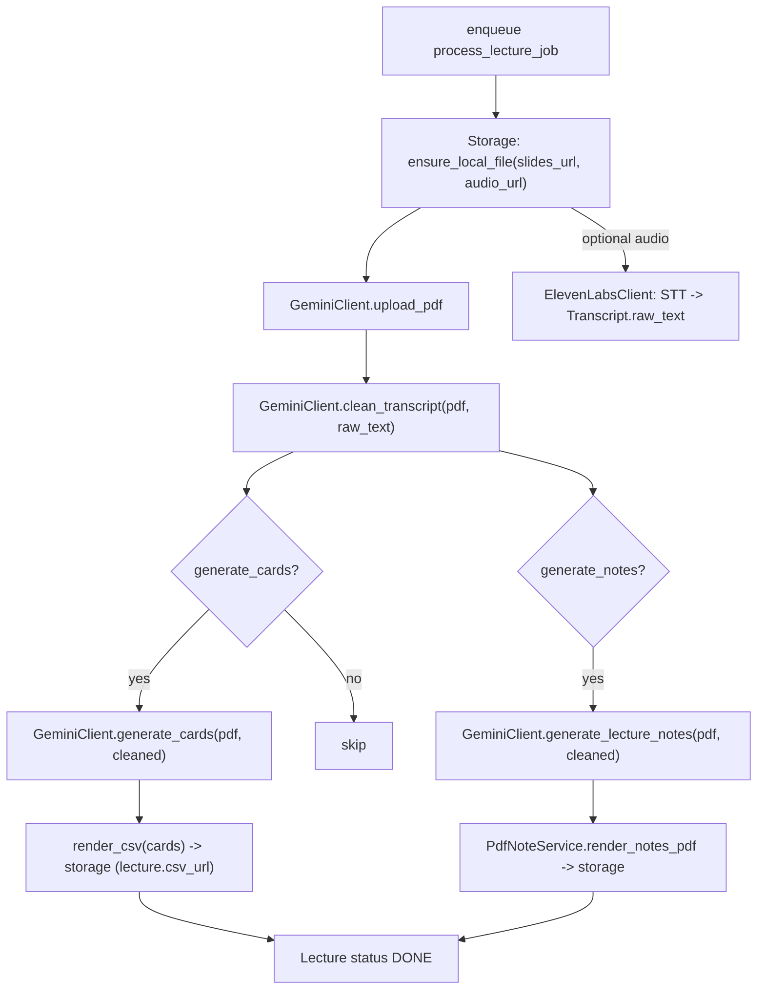
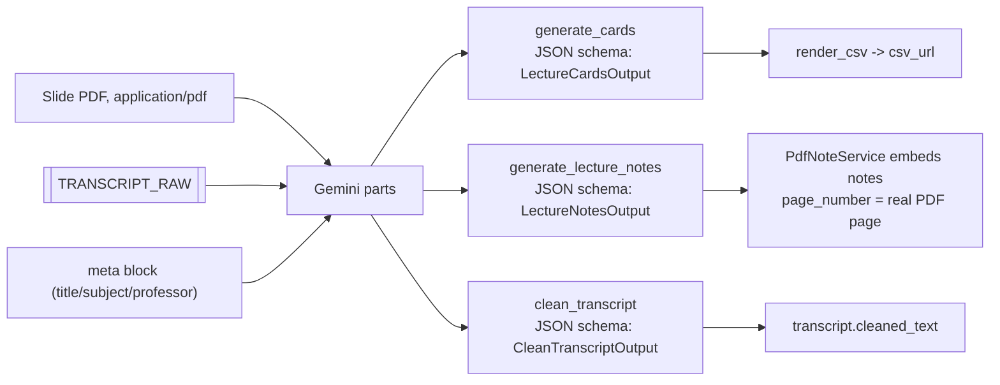
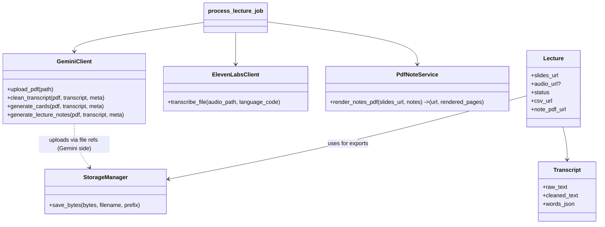
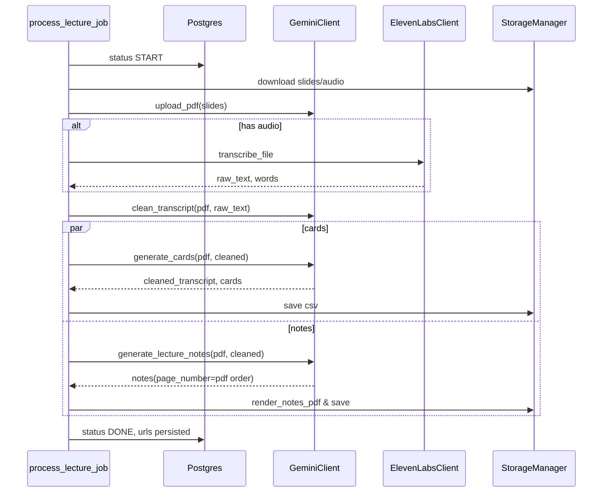

# Ankidude Architecture (Mermaid Edition)

> 슬라이드 PDF와 음성에서 카드·노트를 뽑아내는 흐름을 **간지나게** 그려봤습니다. 각 다이어그램은 실제 코드 컴포넌트와 1:1로 매칭됩니다.

## 1. 백엔드 잡 파이프라인 (Lecture 처리 흐름)

- `process_lecture_job` 중심: `backend/app/services/pipeline.py`
- PDF는 더 이상 텍스트 추출 없이 그대로 Gemini로 업로드해 사용.
- 카드/노트는 병렬 실행, 공통 정제(clean) 결과를 공유.

## 2. LLM 프롬프트 & 입출력 구성

- 파일 파트: `{"file_data": {"file_uri": ..., "mime_type": "application/pdf"}}`
- `page_number`는 슬라이드에 적힌 번호가 아니라 **PDF 실 페이지 인덱스(1-based)** 를 반환하도록 프롬프트에 명시.
- 프롬프트들은 PDF를 **소스 오브 트루스**로, Transcript는 보조(강조·정정)로 사용.

## 3. 핵심 클래스/서비스 지도

- `Lecture` 상태 전이는 `process_lecture_job`에서 관리하며, CSV/노트 PDF URL을 저장.
- `PdfNoteService`는 생성된 노트를 슬라이드 PDF 하단 마진에 직접 렌더링.

## 4. 상태/스텝 타임라인 (로그 기준)

## 사용자가 기억하면 좋은 포인트
- 슬라이드 PDF는 **직접 LLM에 업로드**되어 쓰이며, 추가 텍스트 추출 파이프는 없다.
- 노트 생성 시 페이지 번호는 **PDF 물리적 순서**를 따른다.
- 카드·노트 프롬프트 모두 “PDF=근거, Transcript=보조” 원칙으로 설계. transcript는 강조/정정/맥락만 보탬. 
